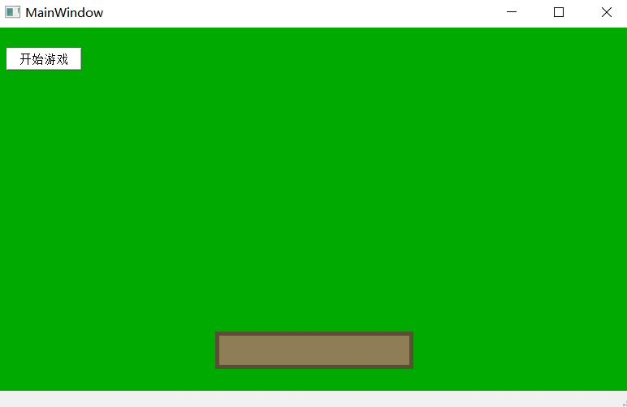
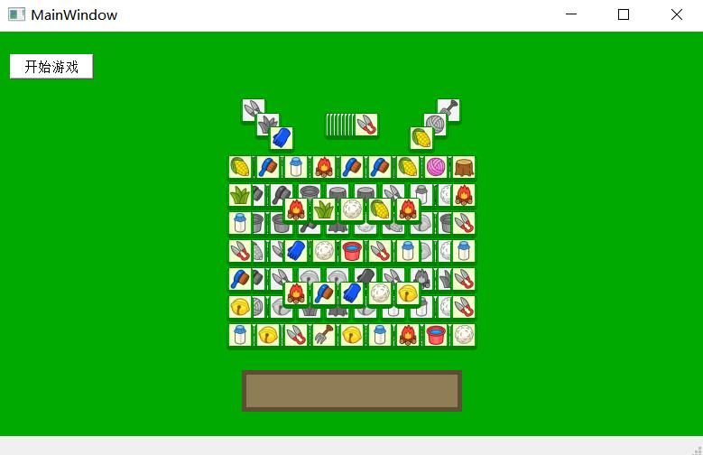

使用QT简单实现了目前微信上很火的“羊了个羊”，主要分为以下三个模块。

1、每个关卡中元素的位置使用json文件来保存。

2、读取json文件，并根据位置信息加载所有的元素

3、点击元素后，将元素移动到消除区域，检测到凑成三个相同元素则消除。

程序启动界面

程序运行界面

项目中有一些还未实现的功能
- [x] 游戏界面不够完整，失败之后不能重新开始
- [ ] 虽然设计了两个关卡，但没有设置选择关卡的界面
- [ ] 添加背景音乐
- [ ] 添加得分系统和计时功能
- [ ] 设计新的关卡

